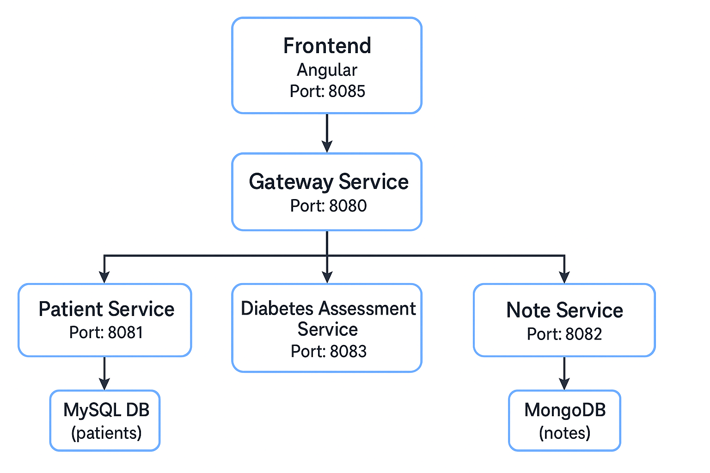

# Medilabo - Application d’évaluation du risque

Ce projet est une application web. Elle permet à un professionnel de santé de consulter les données des patients, leurs notes médicales, et d’évaluer leur risque de diabète.

L'application est basée sur une **architecture microservices** et développée avec **Java Spring Boot** pour le backend et **Angular** pour le frontend

---

## Fonctionnalités principales

- Gestion des patients
- Ajout et consultation de notes médicales
- Évaluation automatique du risque de diabète selon les notes et données du patient
- Authentification sécurisée via JWT
- Interface web moderne avec Angular + Tailwind CSS

---

## Architecture Microservices

Voici une vue d'ensemble simplifiée de l'architecture de l’application :



---

## Lancer l'application

Assurez-vous d'avoir **Docker** et **Docker Compose** installés.

1. Clonez le projet :

```bash
git clone https://github.com/lagourou/OC_PROJECT_9.git
cd OC_PROJECT_9
```

2. Lancer tous les services :

```bash
docker-compose up --build
```

3. Accéder à l'application

- Interface Web : [http://localhost:8085](http://localhost:8085)

---

# Tests Unitaires

L'accent a été mis sur les tests liés à la sécurité (authentification JWT, filtres, autorisations) car c’est un point critique dans cette application

Lancer les tests avec :

```bash
cd gateway-service
mvn test
```

Cette commande génère aussi les rapport Jacoco et Surefire :

- **Jacoco** - Rapport de couverture du code
- **Surefire** - Rapport d'affichage des tests unitaires

---

## Documentation

Commande pour génèrer le rapport Javadoc :

```bash
mvn javadoc:javadoc
```

La documentation du projet est hébergée sur les pages GitHub :

- [**Rapport JaCoCo**](https://lagourou.github.io/OC_PROJECT_9/gateway-service/target/site/jacoco/index.html) — Couverture des tests
- [**JavaDoc**](https://lagourou.github.io/OC_PROJECT_9/apidocs/index.html) — Documentation du code Java
- [**Rapport Surefire**](https://lagourou.github.io/OC_PROJECT_9gateway-service/target/site/surefire-report.html) — Résultats d'exécution des tests

---

## Structure du projet

```

OC_PROJECT_9/
│
├── diabetes-assessment-service ← Évalue le risque de diabète
├── front-service/angular-app ← Frontend Angular
├── gateway-service ← Point d'entrée sécurisé
├── note-service ← Gestion des notes médicales (MongoDB)
├── patient-service ← Gestion des patients (MySQL)
├── docker-compose.yml ← Coordination des conteneurs

```

## Sécurité et communication

- **Authentification JWT** : Lorsqu’un utilisateur se connecte, il reçoit un token (JWT) utilisé pour sécuriser les appels vers les microservices.
- **API Gateway** : Sert de point d’entrée à tous les services backend. Il gère l’authentification, les redirections de requêtes, et cache les adresses internes.
- **Communication entre microservices** : Tous les services sont connectés dans le même réseau Docker, ce qui permet une communication fluide

## Technologies utilisées

- **Java 17** - Langage de programmation
- **Spring Boot** - Framework backend
- **Angular** - Framework frontend
- **Tailwind CSS** - Framework CSS
- **MongoDB** - Base de données NoSQL
- **MySQL** - Base de données relationnelle
- **Docker** - Conteneurisation des services

## Fonctionnalités principales côté utilisateur

- Voir la liste de tous les patients
- Ajouter un patient
- Mettre à jour les informations d’un patient
- Voir l’historique des notes du patient pour connaître ses antécédents médicaux
- Ajouter une note à l’historique
- Obtenir automatiquement une évaluation du risque de diabète
